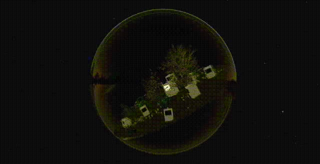

### DASOM LEE (ARDEN)

·

**Product · AI · Interactive**

·

`TypeScript` `React` `Next.js` `Three.js` `React Native` `Flutter`

`Python` `FastAPI` `PostgreSQL` `Supabase` 

`Docker` `Nginx` `Cloudflare` 

`Ollama` `Llama.cpp` `Gemma 4`

·

🔗 [LinkedIn](https://www.linkedin.com/in/ardenspace/) | 📧 [Email](mailto:connect@ardenspace.com) | 🛸 [arden'space](https://ardenspace.com)

